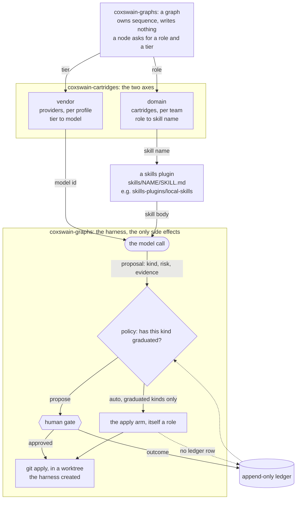
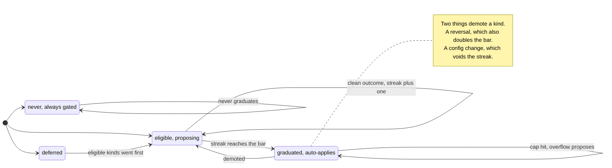

# coxswain-cartridges

A portable substrate for running agent graphs against *your* team's rules.

Graphs reference abstract **roles** (`plan`, `build`, `review_charter`). A
**cartridge** binds those roles to real skills, names where writes land, and
carries the team's own written conventions. The same graph runs for any team
that can fill the contract — swapping trackers, style charters, or model
providers is an edit to one file, not a rewrite.

Nothing writes to a system of record without a human decision until that
specific kind of write has earned it, measured against an append-only ledger.

## Why cartridges

Most agent tooling hardcodes an employer into the automation: this tracker,
that board, those conventions. Then the team changes, or you do, and the
tooling is worthless. Here the seam is explicit and enforced — a graph that
hardcodes a domain constant fails its own acceptance test.

```
core/              pure substrate: merge, policy, manifest, ledger, work store.
cartridges/base/   the contract: roles, write-kind taxonomy, autonomy policy.
cartridges/<team>/ bindings: which skill fills each role, where writes land.
                   local-comfort0/ and local-comfort1/ are COMFORT PRESETS —
                   ramp-only tightenings, legal under the one-way tighten rule.
skills-plugins/    the reference `local-skills` plugin — every role the
                   `local` cartridge binds, so a clean clone resolves.
providers/         tier -> model. the vendor axis, isolated.
```

The graphs — and the **harness** that runs them — live in
[`coxswain-graphs`](https://github.com/ppfenning/coxswain-graphs). The four nouns:
a *harness* owns consequences, a *graph* owns sequence, a *cartridge* (this
repo) owns who a run works for, and a *runner* executes nodes.

## The two axes

| Axis | Changes when | Lives in |
|---|---|---|
| **Domain** | you change teams, trackers, or conventions | `cartridges/` |
| **Vendor** | you change model provider or tier bindings | `providers/` |

A graph sits at the intersection and knows about neither:



The node names a role and a tier. It never learns which skill filled the role or
which model answered — that is the whole seam. The dotted edge is the loop that
makes autonomy earnable: policy reads the ledger, and the ledger only ever
records what happened at the gate.

## Autonomy is earned, per kind

Every write an agent can propose is a named **kind** carrying a **risk** and a
**ramp**. Kinds start propose-only. A kind graduates to auto-apply after N
consecutive clean outcomes at the human gate; one reversal resets the streak
and doubles the bar. Changing the cartridge or the model bindings resets
everything — a track record earned under different rules is not a track record.

The asymmetry is the argument: a wrong proposal costs a minute of review, a
wrong write costs an incident. Buy autonomy only where that ratio has been
measured.



Three things that diagram is making concrete, because they are the ones prose
keeps losing:

- **`skipped` appears nowhere.** A proposal approved but never executed proves
  nothing either way, so it neither builds nor breaks a streak.
- **The bar ratchets.** A reversal does not just reset progress, it doubles the
  price of getting back — so a kind that keeps being wrong gets progressively
  harder to trust, not merely re-tested.
- **Hitting a cap is not a demotion.** The overflow is proposed and the streak is
  left alone; the cap is the policy working, not the kind misbehaving.

Two grains sharpen the diagram without changing its shape:

- **Trust is earned per subject, where a run names one.** A ledger row may
  carry a `subject` — the runbook entry a `doc_update` amends, not the
  `doc_update` category. A proposal carrying a subject has its streak read
  over that entry's own rows; forty good entries cannot carry the one that is
  wrong every time it fires, and a bad entry cannot hold its neighbours back
  at their own grain. Creating a subject always gates: there is no track
  record for something that does not exist yet. Proposals without a subject
  get the old kind-level reading, counting every row — the strict fallback.
- **A pass that took three tries is not a first-try pass.** Rows may carry
  `attempts`, written by the fix loop. A clean with `attempts > 1` neither
  builds nor breaks a streak — the loop converged, which proves the loop
  works, not that the kind is trustworthy first-try. A reversal resets and
  doubles the bar however many attempts it took: reading attempts there would
  let a fix loop buy its way out of the ratchet.

And one kind exists so the system cannot vote on its own rules: the harness
escalates any change whose diff touches governance paths to
`self_modification` (`risk: high`, `ramp: never`, out as a PR), whatever kind
the graph claimed. `merge` itself split by target on 2026-09-01 —
`merge_stack` (into a parent phase branch, earnable) and `merge_main` (to the
default branch, a human at every comfort level) — which made within-initiative
stack merges expressible by narrowing the kind rather than loosening a ramp.

`policy.tracker` names what mirrors this work store, if anything. A GitHub
Projects v2 board is a one-way mirror — the markdown work store under `work/`
stays the source of truth the harness reads, and the tracker only ever
reflects it, never the other direction. `github-projects` is the default the
moment a repository's remote is github.com; `none` switches the mirror off
regardless of remote; naming a tracker a cartridge binds (`jira`, `asana`, and
so on) uses that instead. Every step the mirror needs is planned by a pure
function and carried out by a thin `gh` edge, the same split as everywhere
else in this repository.

## Status

`core/` is implemented and tested. Each module still carries its contract as a
docstring — the contract came first and the implementation was written against
it, never ported. See [`docs/CLEAN-ROOM.md`](docs/CLEAN-ROOM.md) for the working
rule and [`docs/PROVENANCE.md`](docs/PROVENANCE.md) for where the ideas came
from.

- [x] Base cartridge: roles, write kinds, routing, epic threshold, policy
- [x] Base context packs: conventions, epic model
- [x] Worked example team cartridge
- [x] Provider profile
- [x] `core/` implementations
- [x] Tests (synthetic fixtures only)
- [x] Reference skills plugin (`skills-plugins/local-skills`) — the demo contract is CI-enforced
- [x] Merge split by target (`merge_stack` / `merge_main`), `stack_rebase`, `self_modification`
- [x] Subject-grain streaks and fix-loop `attempts` honesty in `core/policy.py`
- [x] Comfort presets 0 and 1 as ramp-only bundles (`local-comfort0`, `local-comfort1`)
- [x] Queue-directory intake (`core/intake.py`) beside `manual`
- [x] Validator, retro, and dispatch roles with real skill bodies
- [x] Graphs and the harness — implemented in [`coxswain-graphs`](https://github.com/ppfenning/coxswain-graphs)

## Getting started

```bash
pip install -e ".[dev]"
cp -r cartridges/example-team cartridges/my-team
$EDITOR cartridges/my-team/cartridge.yaml          # bind roles, name landings
cp context-templates/code-style.md cartridges/my-team/context/
$EDITOR cartridges/my-team/context/code-style.md   # in your own words

python -m core.cartridge --team local --json \
  --skills-root skills-plugins                     # resolve + validate
```

`local` resolves out of the box because its skills ship in this repo. Your own
team's cartridge resolves the same way once `--skills-root` points at a plugin
providing the names it binds — `skills-plugins/local-skills/` is the worked
example of what such a plugin looks like.

`cartridge init <team> --cartridges-dir <workspace>/cartridges` scaffolds the
same layout without the manual `cp -r`: it creates `<team>/`, its `context/`
tree, symlinks to `base` and (by default) `local`, and a `cartridge.yaml`
naming `<team>`. Once every step above has applied, it prints three lines:
`wrote <team dir>`, then `team:` and `cartridges_dir:`. Put the latter two
into `~/.config/coxswain-tools/profile.yaml` so other tools know which cartridge
to load. This command reads its template from the package's own source tree,
so it needs a source checkout of this repository, not an installed wheel.
Left unset, `--cartridges-dir` defaults to `./cartridges` under the current
directory, not the package's. `init` is the one command that writes, so it
writes where you are.

This repo, [`coxswain-graphs`](https://github.com/ppfenning/coxswain-graphs), and
[`coxswain-tools`](https://github.com/ppfenning/coxswain-tools) are set up together,
not one at a time. The order to bring them up in, each repo's environment, the
logins each needs, the `profile.yaml` shape just described, and how to verify
the install are written once, in
[`coxswain-tools`' `docs/getting-started.md`](https://github.com/ppfenning/coxswain-tools/blob/main/docs/getting-started.md) —
that page walks the whole three-repo setup end to end.

`--skills-root` is how the loader checks that every bound skill name resolves to
exactly one skill body; pass it once per plugin root. There is a
`--unverified-skills` escape hatch for resolving without that check, and it
prints a warning every time — a check you can silently skip is not a check.

### Installing local-skills as a Claude Code plugin

This checkout doubles as a local plugin marketplace — its manifest is
`.claude-plugin/marketplace.json`.

```sh
claude plugin marketplace add /path/to/coxswain-cartridges
claude plugin install local-skills@coxswain-cartridges
```

`route` is the optional role the `local` cartridge binds to the `route-work`
skill — the judgment that decides whether a request is work for the harness
(files it and launches a run) or a question to answer inline. A team
substitutes its own by rebinding the role.

## Tests

```bash
pytest -q
```

Fixtures are synthetic and obviously fake. The suite leans hardest on the ways
autonomy must *fail* to be granted: streaks that do not transfer across kinds,
risks, cartridge hashes, or provider profiles; a single reversal resetting the
streak and doubling the bar; and `record_run` deriving outcomes from the gate
rather than believing a run's own account of itself.

## License

MIT — see [LICENSE](LICENSE).
